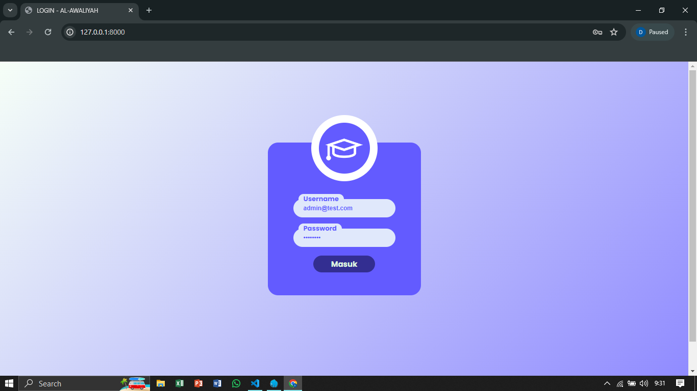
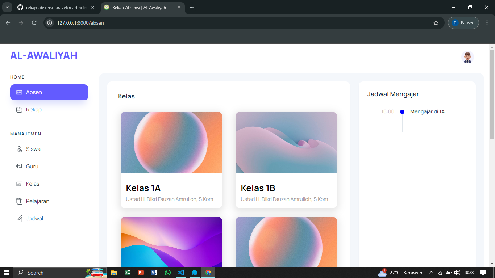
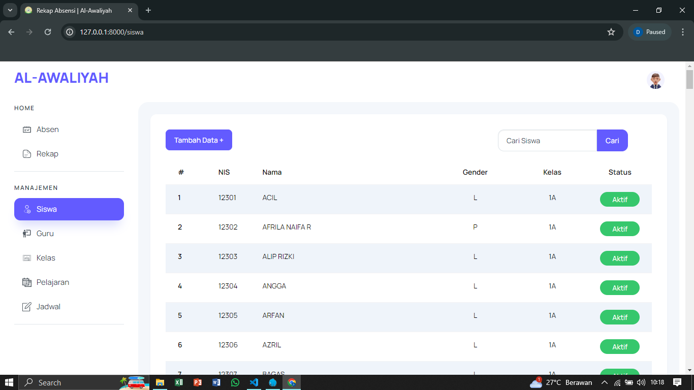
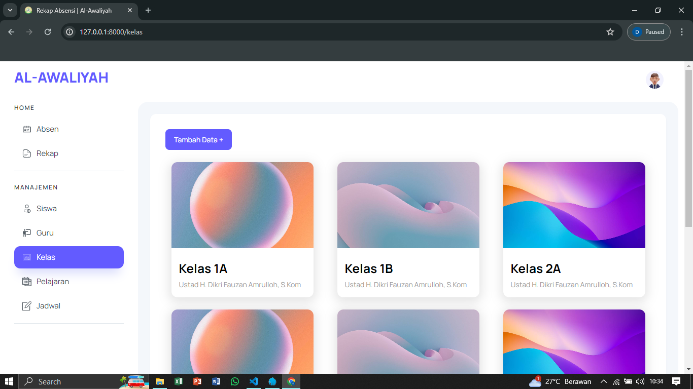
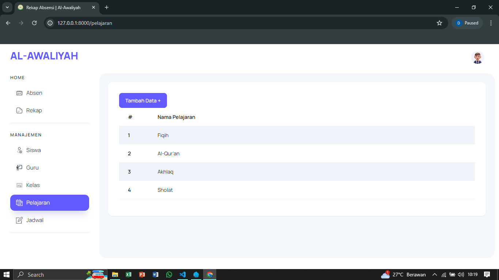
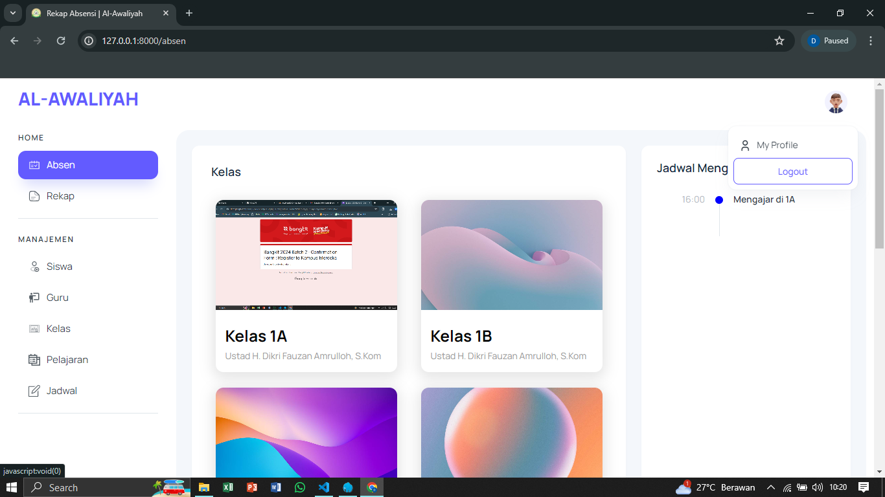

# REKAP ABSENSI

Project ini merupakan Tugas Project Akhir dari Mata Kuliah Pemograman Web 2.

## Daftar isi
- [Persyaratan Sistem](#persyaratan-sistem)
- [Instalasi](#instalasi)
- [Konfigurasi](#konfigurasi)
- [Penggunaan](#penggunaan)
- [Fitur](#fitur)
- [Kontribusi](#kontribusi)
- [Lisensi](#lisensi)

## Persyaratan Sistem

Pastikan sistem Anda memenuhi persyaratan berikut:

- PHP >= 8.2
- Composer
- Web Server (XAMPP atau Laragon)
- Database (MySQL, PostgreSQL, SQLite, dll.)

## Instalasi

Berikut adalah langkah-langkah untuk menginstal proyek ini:

1. Clone repositori ini:

    ```bash
    git clone https://github.com/dikrifzn/rekap-absensi-laravel.git
    cd rekap-absensi-laravel
    ```

2. Instal dependensi menggunakan Composer:

    ```bash
    composer install
    ```

3. Salin file `.env.example` menjadi `.env`:

    ```bash
    cp .env.example .env
    ```

4. Generate application key:

    ```bash
    php artisan key:generate
    ```

5. Atur konfigurasi database di file `.env`:

    ```dotenv
    DB_CONNECTION=mysql
    DB_HOST=127.0.0.1
    DB_PORT=3306
    DB_DATABASE=rekap_absensi
    DB_USERNAME=root
    DB_PASSWORD=
    ```

6. Migrasi dan seed database:

    ```bash
    php artisan migrate --seed
    ```

7. Jalankan server pengembangan:

    ```bash
    php artisan serve
    ```

    Aplikasi akan berjalan di `http://127.0.0.1:8000`.

## Fitur

- [x] Autentikasi
- [x] Absensi
- [x] Rekap Absensi
- [x] Export Rekap ke Excel
- [x] CRUD Data Siswa
- [x] CRUD Data Guru
- [x] CRUD Data Kelas
- [x] CRUD Data Pelajaran
- [x] CRUD Data Jadwal
- [ ] Import siswa dari Excel (segera hadir)

## Penggunaan

### Login

Buka browser dan pergi ke alamat http://127.0.0.1:8000/.
Masukkan kredensial login untuk mengakses Halaman.

Setelah berhasil login, kamu akan diarahkan ke halaman Absen.

Di sini, kamu bisa melihat status login dan berbagai menu di sidebar.

### Mengakses Absensi

Klik menu Absen di sidebar sebelah kiri.
Kamu akan diarahkan ke halaman absensi, di mana kamu bisa memilih kelas untuk mengisi absensi. di sebelah kanan terdapat daily jadwal mengajar yang akan berubah warna ketika waktu mengajar akan di mulai 90/60/30 menit lagi

penggunaan absensi bisa dengan cara memanggil siswa lalu klik pilihan Hadir Sakit Izin Alpha oleh Guru lalu klik tombol Simpan. maka akan tersimpan dan bisa di akses lewat halamam rekap

### Melihat Rekap

Klik menu Rekap di sidebar sebelah kiri.

Di halaman ini, kamu bisa melihat rekap absensi dari semua kelas. bisa memfilter kelas, pelajaran dan bulan apa saja yang ingin di lihat

selain itu rekap kehadiran bisa di unduh dengan meng klik tombol Download Rekap dan memilih di unduh semua atau akan di filter kembali

### Mengelola Siswa

Klik menu Siswa di sidebar sebelah kiri.
Di halaman ini, kamu bisa menambah, mengedit, atau menghapus data siswa.

### Mengelola Guru

Klik menu Guru di sidebar sebelah kiri.
Di halaman ini, kamu bisa menambah, mengedit, atau menghapus data guru.

### Mengelola Kelas

Klik menu Kelas di sidebar sebelah kiri.
Di halaman ini, kamu bisa menambah, mengedit, atau menghapus data kelas. bahkan dalam halaman kelas ini bisa mengganti baground untuk kelas yang jika ketika menambahkan kelas tidak menyertakan bagroundnya maka akan di gantika secara default oleh sistem.

### Mengelola Pelajaran

Klik menu Pelajaran di sidebar sebelah kiri.
Di halaman ini, kamu bisa menambah, mengedit, atau menghapus data pelajaran.

### Mengelola Jadwal

Klik menu Jadwal di sidebar sebelah kiri.
Di halaman ini, kamu bisa menambah, mengedit, atau menghapus jadwal mengajar.

### Log Out

Klik gambar di pojok kanan atas untuk memunculkan tombol log out. maka sesi anda akan berakhir dan di arahkan kembali ke halaman login

## Kontribusi

Jika Anda ingin berkontribusi pada proyek ini, ikuti langkah-langkah berikut:

1. Fork repositori ini.
2. Buat branch baru:

    ```bash
    git checkout -b fitur-baru
    ```

3. Lakukan perubahan dan commit:

    ```bash
    git commit -m "Menambahkan fitur baru"
    ```

4. Push ke branch:

    ```bash
    git push origin fitur-baru
    ```

5. Buat pull request.

---

<p align="center"><a href="https://laravel.com" target="_blank"></a></p>

<p align="center">
<a href="https://github.com/laravel/framework/actions"></a>
<a href="https://packagist.org/packages/laravel/framework"></a>
<a href="https://packagist.org/packages/laravel/framework"></a>
<a href="https://packagist.org/packages/laravel/framework"></a>
</p>

## About Laravel

Laravel is a web application framework with expressive, elegant syntax. We believe development must be an enjoyable and creative experience to be truly fulfilling. Laravel takes the pain out of development by easing common tasks used in many web projects, such as:

- [Simple, fast routing engine](https://laravel.com/docs/routing).
- [Powerful dependency injection container](https://laravel.com/docs/container).
- Multiple back-ends for [session](https://laravel.com/docs/session) and [cache](https://laravel.com/docs/cache) storage.
- Expressive, intuitive [database ORM](https://laravel.com/docs/eloquent).
- Database agnostic [schema migrations](https://laravel.com/docs/migrations).
- [Robust background job processing](https://laravel.com/docs/queues).
- [Real-time event broadcasting](https://laravel.com/docs/broadcasting).

Laravel is accessible, powerful, and provides tools required for large, robust applications.

## Learning Laravel

Laravel has the most extensive and thorough [documentation](https://laravel.com/docs) and video tutorial library of all modern web application frameworks, making it a breeze to get started with the framework.

You may also try the [Laravel Bootcamp](https://bootcamp.laravel.com), where you will be guided through building a modern Laravel application from scratch.

If you don't feel like reading, [Laracasts](https://laracasts.com) can help. Laracasts contains thousands of video tutorials on a range of topics including Laravel, modern PHP, unit testing, and JavaScript. Boost your skills by digging into our comprehensive video library.

## Laravel Sponsors

We would like to extend our thanks to the following sponsors for funding Laravel development. If you are interested in becoming a sponsor, please visit the [Laravel Partners program](https://partners.laravel.com).

### Premium Partners

- **[Vehikl](https://vehikl.com/)**
- **[Tighten Co.](https://tighten.co)**
- **[WebReinvent](https://webreinvent.com/)**
- **[Kirschbaum Development Group](https://kirschbaumdevelopment.com)**
- **[64 Robots](https://64robots.com)**
- **[Curotec](https://www.curotec.com/services/technologies/laravel/)**
- **[Cyber-Duck](https://cyber-duck.co.uk)**
- **[DevSquad](https://devsquad.com/hire-laravel-developers)**
- **[Jump24](https://jump24.co.uk)**
- **[Redberry](https://redberry.international/laravel/)**
- **[Active Logic](https://activelogic.com)**
- **[byte5](https://byte5.de)**
- **[OP.GG](https://op.gg)**

## Contributing

Thank you for considering contributing to the Laravel framework! The contribution guide can be found in the [Laravel documentation](https://laravel.com/docs/contributions).

## Code of Conduct

In order to ensure that the Laravel community is welcoming to all, please review and abide by the [Code of Conduct](https://laravel.com/docs/contributions#code-of-conduct).

## Security Vulnerabilities

If you discover a security vulnerability within Laravel, please send an e-mail to Taylor Otwell via [taylor@laravel.com](mailto:taylor@laravel.com). All security vulnerabilities will be promptly addressed.

## License

The Laravel framework is open-sourced software licensed under the [MIT license](https://opensource.org/licenses/MIT).
